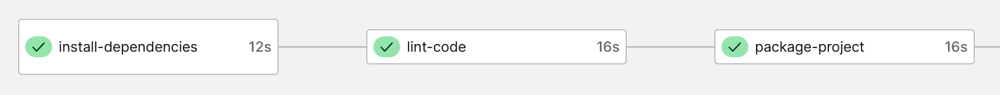
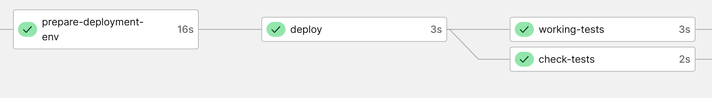
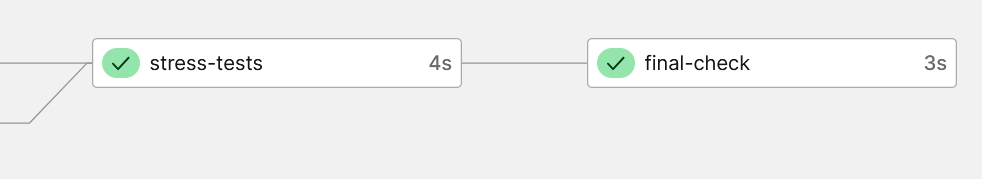

To make a CI-CD pipeline, the process is not really hard.

First you'll have to make a GitHub repository. This repo must respect the gitflow:
- The "Main" Branch is the one where the currently deployed version is.
- The "Develop" branch is where things happen. Devs will make features in special branches that will be merged into this one.
- The "Feature" Branches where dev will implement functionalities.
- The "HotFix" Branches are where special last minutes patches are made and sent directly to production.

Then we'll use CircleCI to create automated jobs such as tests and deployment.
For that we need to create a new project on the web app that will be based of of our GitHub repository. The GitHub repository must contain a config file for CircleCi named
.CircleCi/config.yml . In this file, we'll use the yml language to create tasks. This file is composed of two main parts:
 - The jobs part, where all our tasks are created.
 - The workflow part, where all our jobs are used.
The jobs consist in 3 main types: build, test and deploy. Depending on the branch where the changes are made, not all 3 types must be called. For exemple, a change on the development feature should no trigger a deployment.
A build job exemple :
  ````yml
install-dependencies:
    executor: node/default
    steps:
      - checkout
      - run:
          name: Build dependencies
          command: echo "Building things..."
      - run:
          name: Install dependencies
          command: npm install
````

Then the workflow does the job of calling out jobs at the right time. For exemple, test jobs shouldn't be triggered until build jobs are done. For that, there are a few keywords such as "requires". You can also limit the jobs depending on the branch the change was made on using the keyword filter, then branches then only and then making a list of the branches the test can run on. An exemple of job calling in the workflow:

````yml
- prepare-deployment-env:
  requires:
    - package-project
  filters:
    branches:
      only:
        - main
        - hotfix
````

A well executed process should look like this in the end:






## The config code in this repo has a working linter that took quite some time to setup. I also wanted to add a real deploy function to my server but I did not have enough time.


# Next.js + Jest

This example shows how to configure Jest to work with Next.js.

This includes Next.js' built-in support for Global CSS, CSS Modules and TypeScript. This example also shows how to use Jest with the App Router and React Server Components.

> **Note:** Since tests can be co-located alongside other files inside the App Router, we have placed those tests in `app/` to demonstrate this behavior (which is different than `pages/`). You can still place all tests in `__tests__` if you prefer.

## Deploy your own

[](https://vercel.com/new/clone?repository-url=https://github.com/vercel/next.js/tree/canary/examples/with-jest&project-name=with-jest&repository-name=with-jest)

## How to Use

Execute [`create-next-app`](https://github.com/vercel/next.js/tree/canary/packages/create-next-app) with [npm](https://docs.npmjs.com/cli/init), [Yarn](https://yarnpkg.com/lang/en/docs/cli/create/), or [pnpm](https://pnpm.io) to bootstrap the example:

```bash
npx create-next-app --example with-jest with-jest-app
```

```bash
yarn create next-app --example with-jest with-jest-app
```

```bash
pnpm create next-app --example with-jest with-jest-app
```

## Running Tests

```bash
npm test
```

```bash
yarn test
```

```bash
pnpm test
```

Deploy it to the cloud with [Vercel](https://vercel.com/new?utm_source=github&utm_medium=readme&utm_campaign=next-example) ([Documentation](https://nextjs.org/docs/deployment)).


### - Raphaël Zanatta
